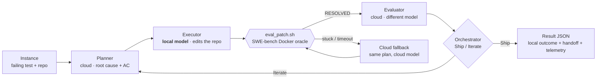

# local-first-agent-harness

[](https://github.com/ziyilam3999/local-first-agent-harness/actions/workflows/ci.yml)
[](LICENSE)
[](https://www.python.org/downloads/)

**A local-first agent harness that fixes real code bugs — runs the heavy work on your local model, escalates to the cloud only when it's stuck, and grades itself with real tests (not an LLM).**

Most "AI coding agent" demos run every step on an expensive cloud model and grade themselves
with another LLM ("looks good to me!"). This one is different on both axes. It runs the heavy
lifting — actually editing files in a real repo — on a **cheap local model** (via Ollama), and
only reaches for the cloud when the local model gets stuck. And it never grades itself with an
LLM: a candidate fix only "passes" when the project's **real test suite** says it does, scored
by the canonical [SWE-bench](https://www.swebench.com/) Docker harness. The result: most of the
work is free, and "resolved" means resolved.

## Early results (n=13, SWE-bench Verified)

A 4-way comparison on 13 real bug-fix tasks — 1-shot Opus, 1-shot Sonnet, a full-cloud relay, and
the local-first hybrid relay — all graded by the SWE-bench Docker oracle:

| Approach | Resolved | Total cost | $ / resolved |
|---|---|---|---|
| 1-shot Opus | 54% (7/13) | $11.8 | $1.68 |
| 1-shot Sonnet | 46% (6/13) | $21.3 | $3.54 |
| Full-cloud relay | **77% (10/13)** | $35.0 | $3.50 |
| **Local-first hybrid** | 54% (7/13) → **62% (8/13) with cloud fallback** | **$15.7** | $2.24 |

The full-cloud relay is the quality ceiling. The **local-first hybrid matches single-shot Opus
quality at ~45% of the full-cloud relay's cost** — and on the *hardest* tasks (the ones that need
real iteration) it **matched** the full-cloud relay, and with cloud fallback edged ahead. (1-shot
Sonnet is the weakest arm here — lowest resolve rate *and* poor value, dominated by both Opus
single-shot and the hybrid.) In short: local-first is the value play, and it pays off exactly where
it should — the hard bugs.

> n=13 is a small sample — these numbers are directional, not statistically significant, and "local"
> means the *executor* runs locally (the planner/evaluator are still cloud). Reproduce with the
> commands below and judge for yourself.

### Where the cost goes — and what "local" actually saves

That cost column is the most counter-intuitive part, so it's worth being precise. The hybrid is
*more* expensive than a single Opus shot ($15.7 vs $11.8) — which looks backwards when its heaviest
role runs on a **free** local model. Here's where the hybrid's money actually went, per role, across
the 13 bugs:

| Role | Backend | Cost | Share |
|---|---|---|---|
| Planner | cloud Opus | $8.9 | 52% |
| Evaluator | cloud | $6.8 | 40% |
| **Executor** | **local model** | **$0.0** | **0%** |
| Cloud fallback (hard bugs only) | cloud Sonnet | $1.4 | 8% |

The executor is "heaviest" in **tokens and wall-time** — it does the actual file-editing labor
(read, grep, edit, run tests, iterate) — and it ran for **free**. What you pay for is the two cloud
*brains* around it: an architect that writes the plan and a reviewer that checks the diff and runs
the real test, on every bug, sometimes twice.

So the hybrid isn't cheaper than one Opus shot — a single shot has no planner, no reviewer, and no
retry. The honest comparison is the **same chain run entirely in the cloud** (the full-cloud relay):
moving just the executor to a local model cut that chain's cost from **$35.0 to $15.7 — a 55%
saving** — while *matching* its quality on the hardest bugs. That's what local-first buys you: not a
cheaper single call, but the full quality of an iterating, self-testing chain at **under half the
full-cloud price**.

Read another way — how the hybrid compares to each alternative:

- **vs 1-shot Sonnet** — strictly better: cheaper *and* higher quality (Sonnet single-shot is the
  weakest arm, dominated on both axes).
- **vs 1-shot Opus** — smarter, because a single shot is *blind*: it writes a patch and hopes. The
  hybrid plans, runs the real test, and retries — so it resolves more, and on the hardest bugs it
  matched the full-cloud relay where one Opus shot fell short. (Opus single-shot is cheaper *per
  win on easy bugs*, where one good shot is already enough.)
- **vs full-cloud relay** — the same chain at ~half the price, matching it on the hardest bugs;
  you trade a little raw quality on easy bugs for the 55% cost cut.

## How it works

The engine is a small relay of three roles, run as real `claude` agent subprocesses, with a free
Python orchestrator deciding what happens between them:

1. **Planner** studies the failing test and the real code, proves the root cause, and writes a
   plan with observable, testable acceptance criteria. (No code.)
2. **Executor** implements that plan with real tools (Read/Grep/Edit/Write/Bash) in a real
   checkout of the repo, and self-checks its work. This is the heavy role — the one you want on a
   cheap local model.
3. **Evaluator** runs on a *different* model than the executor (so it can catch what the author
   can't see), reviews the plan and the diff, then runs the **real test** via `eval_patch.sh` and
   bases its verdict on the actual `RESOLVED=true|false`.

The orchestrator folds those into a deterministic **Ship / Iterate** decision (no extra LLM in the
loop), capped per iteration with live **stuck-detection** — if the executor starts spinning on the
same tool call, it's killed and the partial result is graded honestly instead of burning the whole
time budget. Every role can run on a different model (heterogeneous per-role models), and when the
executor runs locally you can turn on **cloud fallback** so a hard bug the local tier can't crack is
handed to a cloud model — while the honest local result is preserved separately.



The orchestrator and the oracle are free Python — only the three boxed roles cost tokens, and in
local-first mode the heavy one (executor) is free too.

## Quickstart (cloud-only, ~5 minutes)

The easiest way to try it: run all three roles on the cloud. No local model required.

**Prerequisites:**

- The [`claude` CLI](https://docs.anthropic.com/en/docs/claude-code) installed and authenticated
  (an Anthropic API key or a Claude subscription login).
- **Docker** running (the test oracle scores patches in SWE-bench's Docker images).
- Python 3.10+.

**Install:**

```bash
pip install git+https://github.com/ziyilam3999/local-first-agent-harness
```

> Not on PyPI yet — install straight from GitHub with the command above. A PyPI release
> (`pip install local-first-agent-harness`) is planned.

**Run on the bundled example** (a real Flask bug):

```bash
lfah run --instance examples/flask-5014.instance.json
```

By default this runs `planner=opus`, `executor=sonnet`, `evaluator=opus`, all on the cloud, in
mode `c` (one replan + one executor retry allowed). It prints a per-role telemetry table (tokens,
cost, wall time, output tokens/sec) and writes a full result JSON under `runs/`.

> The example instance describes the bug. To actually let the executor edit code, the engine needs
> the target repo checked out at the instance's `base_commit` in a `repo/` directory next to the
> instance file. Use `--dry-run` to exercise the chain wiring end-to-end without calling any model
> or the oracle.

## Local-first + cloud fallback (the feature)

This is the point of the project: run the expensive executor role on a **free local model**, and
only pay for the cloud when the local model gives up.

1. **Install a local model with [Ollama](https://ollama.com/)** and pull a capable coding model,
   for example:

   ```bash
   ollama pull qwen3-coder
   ```

2. **Put a local, Anthropic-compatible proxy in front of Ollama** so the `claude` CLI can talk to
   it. The CLI speaks the Anthropic Messages API; Ollama speaks its own — a small router bridges
   them. The reference setup uses [claude-code-router](https://github.com/musistudio/claude-code-router):

   ```bash
   npm install -g @musistudio/claude-code-router
   ccr start                       # listens on http://127.0.0.1:3456 by default
   curl -s http://127.0.0.1:3456/ >/dev/null && echo "proxy up"
   ```

   The engine points the local backend at `LFAH_CCR_BASE_URL` (default `http://127.0.0.1:3456`) —
   set that env var if your proxy listens elsewhere. Any Anthropic-compatible shim works; it just
   has to forward to your Ollama model.

   > **Hardware.** The executor is the heavy role. A 30B-class quantized coding model wants roughly
   > 24–32 GB of free RAM/VRAM; only one local model is ever resident at a time (planner and
   > evaluator stay on the cloud), so you don't need to fit several at once.

3. **Run local-first with one flag:**

   ```bash
   lfah run --instance examples/flask-5014.instance.json \
     --local --local-model qwen3-coder
   ```

   `--local` sets the executor backend to `local`, runs the executor on your local model, keeps the
   planner and evaluator on the cloud (so the evaluator is always a different model than the
   executor, and only one local model is ever resident), and enables **cloud fallback**. If the
   local executor times out or gets stuck, the same plan is handed to a cloud model
   (`--cloud-fallback`, default `sonnet`) — and the honest local outcome is preserved in a separate
   `handoff` field in the result JSON.

   Prefer to wire it explicitly? `--executor-backend local --local-model <name> --cloud-fallback sonnet`
   does the same thing without the convenience defaults.

## CLI reference

```
lfah run --instance <path.json>
         [--planner opus] [--executor sonnet] [--evaluator opus]
         [--executor-backend cloud|local] [--local-model <name>]
         [--cloud-fallback <model>] [--mode a|c] [--out <dir>]
         [--local] [--dry-run]

lfah --version
lfah -h
```

- `--mode a` — single executor round, no replan.
- `--mode c` — up to one replan and one executor retry (default).
- `--dry-run` — run the full chain wiring without calling models or the oracle (handy for a smoke).

## Configuration (environment variables)

Everything that couples to your machine is an environment variable with a safe default.

| Variable | Default | What it controls |
|---|---|---|
| `LFAH_DOCKER_HOST` | `unix:///var/run/docker.sock` | Docker socket the test oracle talks to. |
| `LFAH_DATASET` | `princeton-nlp/SWE-bench_Verified` | SWE-bench dataset the oracle scores against. |
| `LFAH_SPLIT` | `test` | Dataset split. |
| `LFAH_VENV_PY` | the running Python | Python interpreter that has the `swebench` package. |
| `LFAH_CCR_BASE_URL` | `http://127.0.0.1:3456` | Base URL for the local backend (your Ollama proxy). |
| `LFAH_CLAUDE_BIN` | `claude` | The agent CLI binary. |
| `LFAH_CLAUDE_TIMEOUT_S` | `900` | Per-role time cap (seconds) before a role is killed. |
| `LFAH_CLOUD_HANDOFF` | `0` | Set to `1` to escalate a stuck/timed-out local executor to the cloud. |
| `LFAH_CLOUD_HANDOFF_MODEL` | `sonnet` | Cloud model used for the fallback handoff. |
| `LFAH_BUNDLE_DIR` | bundled role files | Override the directory holding `agents/` + `skills/`. |
| `RELAY_SAVE_LEARNINGS` | `0` | Set to `1` to write per-run notes/run-data locally. Off by default. |
| `RELAY_LESSONS_BIN` | (unset) | Optional path to a "prior lessons" lookup binary; disabled unless set. |

The stuck-detection thresholds (`LFAH_LOOP_WINDOW`, `LFAH_LOOP_THRESHOLD`, `LFAH_LOOP_DISTINCT_MAX`) are
also tunable; the defaults are conservative so healthy read→edit→test iteration never trips them.

## Why this architecture

- **Cost.** The executor does the bulk of the token-heavy work. Running it on a local model makes
  the common case free; you only pay the cloud on the hard bugs that trigger fallback.
- **Honest grading.** "Resolved" is decided by the project's real `FAIL_TO_PASS` test in the
  canonical SWE-bench Docker environment — not by an LLM grading its own homework. The evaluator
  also runs on a different model than the executor, so it can catch mistakes the author can't see.
- **Bounded.** A per-role time cap plus live stuck-detection means a runaway role is killed and
  graded honestly, never left to burn the whole budget.

## License

MIT. See [LICENSE](LICENSE).
